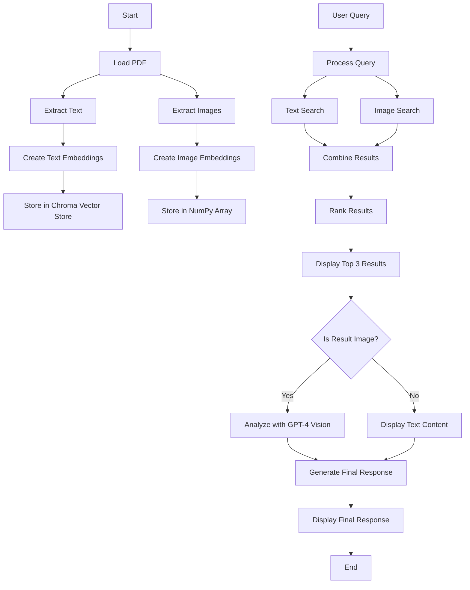

# Multimodal Search Engine

This project implements a multimodal (text + images) semantic search engine using Langchain and OpenAI's models. It processes a PDF document, extracts text and images, and allows users to perform semantic searches across both modalities.




## Features

- PDF processing: Extracts text and images from a given PDF file.
- Text-based search: Uses OpenAI embeddings and Chroma vector store for semantic text search.
- Image-based search: Utilizes OpenCLIP embeddings for image similarity search.
- Multimodal results: Combines and ranks results from both text and image searches.
- GPT-4 Vision integration: Analyzes image content based on user queries.
- Streamlit UI: Provides a user-friendly interface for querying and viewing results.

## Prerequisites

- Docker and Docker Compose
- OpenAI API key

## Setup

1. Clone the repository:
   ```
   git clone https://github.com/your-username/multimodal-search-engine.git
   cd multimodal-search-engine
   ```

2. Create a `.env` file in the project root and add your OpenAI API key:
   ```
   OPENAI_API_KEY=your_openai_api_key_here
   ```

3. Ensure your PDF file is in the project directory and update the `pdf_path` in `app.py` if necessary.

## Running the Application

1. Build and start the Docker container:
   ```
   docker-compose up --build
   ```

2. Open a web browser and navigate to `http://localhost:8501` to access the Streamlit app.

## Usage

1. Enter your query in the text input field.
2. The app will process your query and display the top 3 results, which can be either text excerpts or images from the PDF.
3. For image results, the app will provide an analysis using GPT-4 Vision.
4. A final summarized response based on all results will be generated using GPT-4.

## Project Structure

- `app.py`: Main Streamlit application file
- `Dockerfile`: Instructions for building the Docker image
- `docker-compose.yml`: Docker Compose configuration file
- `requirements.txt`: List of Python dependencies
- `.env`: Environment variables file (create this and add your OpenAI API key)
- `your_pdf_file.pdf`: The PDF file to be processed (replace with your actual PDF)

## Troubleshooting

- If you encounter any issues with dependencies, try updating the `requirements.txt` file and rebuilding the Docker image.
- Ensure your OpenAI API key is correctly set in the `.env` file.
- Check that the PDF file path in `app.py` is correct.

## Contributing

Feel free to open issues or submit pull requests for any improvements or bug fixes.

